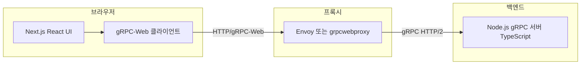

# gRPC 채팅 프로젝트 — 전체 설계서

## 1. 목적과 범위

- **목적**: 브라우저(웹)와 gRPC 서버 간 채팅을 학습·실습한다.
- **현재 상태**: gRPC 서버는 **Node.js + TypeScript** (`packages/grpc-server`), 웹은 **Next.js** (`apps/web`) + gRPC-Web, Envoy 설정 사용.
- **레거시**: CRA `client/` 는 선택적으로 유지·제거한다.

---

## 2. 용어 정리

| 용어 | 설명 |
|------|------|
| **gRPC** | HTTP/2 기반 RPC. 브라우저는 직접 gRPC(바이너리) 호출이 제한적이라 **gRPC-Web** + 프록시(Envoy 등) 조합이 일반적이다. |
| **gRPC-Web** | 브라우저용으로 제한된 gRPC 프로토콜. 생성된 JS 클라이언트가 이를 사용한다. |
| **Next.js** | React 기반 풀스택 프레임워크. **기본 API는 HTTP**(Route Handlers). “Next.js = gRPC 서버”로만 두면 역할이 맞지 않을 수 있다. |

---

## 3. 권장 아키텍처 (TS + Next.js 전환 후)

### 3.1 구성 요소



- **Next.js**: 친구 담당 UI(페이지, 라우팅, 상태)와 환경 변수로 **gRPC-Web 게이트웨이 URL**만 노출하는 역할이 자연스럽다.
- **gRPC 서버(Node + TypeScript)**: `@grpc/grpc-js`로 기존 `server.proto`의 **UserService / MessageService**를 구현하는 **별도 프로세스**(또는 모노레포 내 `packages/grpc-server` 같은 패키지).
- **Envoy(또는 대안)**: 브라우저 → gRPC-Web → (변환) → 백엔드 gRPC. 로컬 개발 시 포트를 **문서화하여 클라이언트·Envoy·서버가 동일**하게 맞춘다.

### 3.2 Next.js와 gRPC 서버를 한 저장소에 두는 이유

- 프로토콜 버퍼(`.proto`)를 **단일 소스**로 두고, 서버용 코드 생성과(필요 시) 클라이언트용 grpc-web 생성 스크립트를 같이 관리하기 쉽다.
- “백엔드 언어를 TS로 바꾼다”는 요구는 **gRPC 서버 구현체**를 Node/TS로 옮기는 것으로 정의하는 것이 구현 난이도와 학습 목적에 맞다.

### 3.3 대안 (참고만)

- Next.js **Route Handler만**으로 REST/JSON API를 새로 만들고 브라우저는 fetch만 쓰는 방식: gRPC 학습 목적에서는 **프로토콜이 바뀌어** 현재 설계와 다름.
- Next.js **Custom Server**에 gRPC를 얹는 방식: App Router·배포와 궁합이 나쁜 경우가 많아 비권장에 가깝다.

---

## 4. 도메인 및 API (기존 proto 유지 전제)

루트 `proto/server.proto` 기준:

| 서비스 | RPC | 역할 |
|--------|-----|------|
| UserService | Register, Login, Logout | 사용자 등록·로그인·로그아웃(현재는 단순 응답 문자열) |
| MessageService | SendMessage | 메시지 전송 |
| MessageService | StreamMessages | 메시지 스트림(서버 → 클라이언트) |
| MessageService | NotifyUserJoin / NotifyUserLeave | 입장·퇴장 알림 스트림 |

**메시지 / 사용자 모델**은 proto의 `UserInfo`, `Message`, `UserJoin`, `UserLeave` 등과 동일하게 유지한다.

---

## 5. 비기능 요구 (초기 단계)

- **로컬 실행**: README 수준으로 “서버 기동 → Envoy 기동 → Next.js dev” 순서를 명시한다.
- **포트 정책**: Envoy **8080** → gRPC **50051**, 웹 **3001**(Next dev), 브라우저 gRPC-Web은 기본 **같은 출처 `/grpc-web` 프록시**를 사용한다.
- **스트리밍**: TS 서버는 메모리 브로드캐스트로 동작한다. 영속 큐·브로커는 후속 과제.

---

## 6. 디렉터리 구조 (제안)

모노레포 예시:

```
repo-root/
  proto/                 # server.proto (공통)
  apps/
    web/                 # Next.js (친구 프론트 이전 대상)
  packages/
    grpc-server/         # Node TS gRPC 서버
  envoy/                 # 기존 Envoy 설정(포트 정합 후 사용)
  docs/                  # 본 문서들
```

Python `server/` 는 제거되었다. CRA `client/` 는 선택적으로 유지·제거한다.

---

## 7. 이 문서의 다음 단계

- 구체적인 **파일 단위 변경 목록**과 **작업 순서**는 `02_MIGRATION_SCOPE.md`를 따른다.
- **로컬에서 서버·Envoy·웹 실행 방법**은 `03_LOCAL_RUN.md`를 따른다.
