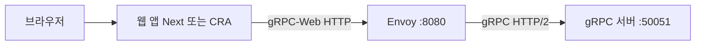

# 로컬 실행 가이드

브라우저에서 채팅 UI까지 동작시키기 위한 **실행 순서·명령어·트러블슈팅**을 정리합니다.

## 아키텍처 (로컬)



- 브라우저는 **gRPC 직접 포트(50051)** 가 아니라 **gRPC-Web** 으로 **게이트웨이(보통 Envoy)** 에 붙는 것이 일반적입니다.
- 따라서 **gRPC 서버 + 게이트웨이 + 웹** 세 가지를 동시에 띄우는 구성이 기본입니다.
- **Envoy 없이** 가능한지, **다른 우회(BFF 등)** 는 [04_ENVOY_ALTERNATIVES.md](./04_ENVOY_ALTERNATIVES.md) 를 참고하세요.
- **Docker Desktop 없이** WSL2·무료 Docker Engine·`docker compose` 는 [05_WSL2_DOCKER_FREE.md](./05_WSL2_DOCKER_FREE.md) 와 저장소 루트 `docker-compose.yml` 을 참고하세요.

## 사전 요구사항

- **Node.js** (LTS 권장), **npm**
- **Envoy** 바이너리 *또는* Docker (Envoy 컨테이너)
- 저장소 루트에서 한 번: `npm install`

## 포트 요약

| 서비스 | 포트 | 설명 |
|--------|------|------|
| gRPC 서버 (Node) | **50051** | `GRPC_PORT` 로 변경 가능 |
| Envoy (gRPC-Web) | **8080** | `envoy.yaml` 리스너 |
| Next.js (`apps/web`) | **3000** | `next dev` 기본 |
| CRA (`client`) | **3000** (기본) | Next와 동시 실행 시 포트 충돌 → 한쪽만 켜거나 포트 변경 |

## 실행 순서 (권장: 터미널 3개)

저장소 루트 경로 예: `D:\...\gRPC-chat\gRPC-chat` — 아래는 **루트에서** 실행한다고 가정합니다.

### 0) 최초 1회 — 의존성

```bash
npm install
```

### 1) 터미널 1 — gRPC 서버

```bash
npm run grpc:dev
```

정상 시 로그에 `gRPC server listening on 0.0.0.0:50051` 에 가까운 메시지가 보입니다.

**환경 변수 (선택)**

| 변수 | 기본값 | 설명 |
|------|--------|------|
| `GRPC_PORT` | `50051` | 리슨 포트 |
| `GRPC_HOST` | `0.0.0.0` | 바인드 주소 |

PowerShell 예시:

```powershell
$env:GRPC_PORT="50051"
npm run grpc:dev
```

### 2) 터미널 2 — Envoy

설정 파일: `envoy/envoy.yaml`  
업스트림(백엔드 gRPC): **`127.0.0.1:50051`** (gRPC 서버와 포트가 반드시 일치해야 함)

**호스트에 Envoy가 설치된 경우** (루트 또는 yaml 절대 경로 지정):

```bash
envoy -c envoy/envoy.yaml
```

**Windows PowerShell — Docker로 Envoy만 실행할 때**

컨테이너 내부의 `127.0.0.1`은 호스트가 아니므로, gRPC를 **호스트**에서 돌리면 기본 yaml로는 백엔드에 연결되지 않을 수 있습니다. 이 경우:

- Envoy도 **호스트**에서 실행하거나,
- 별도 yaml에서 클러스터 주소를 `host.docker.internal` 등으로 바꿉니다.

Docker 예시 (호스트와 연동이 맞을 때만 참고):

```powershell
docker run --rm -p 8080:8080 `
  -v "${PWD}/envoy/envoy.yaml:/etc/envoy/envoy.yaml:ro" `
  envoyproxy/envoy:v1.31-latest `
  envoy -c /etc/envoy/envoy.yaml
```

### 3) 터미널 3 — 웹

#### A) Next.js (`apps/web`) — 워크스페이스 스크립트

최초 1회, 환경 파일 복사:

```powershell
copy apps\web\.env.local.example apps\web\.env.local
```

실행:

```bash
npm run web:dev
```

브라우저: **http://localhost:3000**

`.env.local` 의 `NEXT_PUBLIC_GRPC_WEB_URL` 기본값은 **`http://localhost:8080`** (Envoy) 입니다.

#### B) CRA (`client/`) — 워크스페이스 밖

```bash
cd client
npm install
npm start
```

CRA 예제가 **`http://localhost:50051`** 을 가리키면 브라우저+gRPC-Web 경로와 맞지 않을 수 있습니다. **프론트 담당과 상의해** `http://localhost:8080` (Envoy) 로 맞추는 것을 권장합니다.

---

## npm 스크립트 (저장소 루트)

| 스크립트 | 설명 |
|----------|------|
| `npm run grpc:dev` | `@grpc-chat/grpc-server` 개발 모드 (`tsx watch`) |
| `npm run web:dev` | `@grpc-chat/web` Next.js 개발 서버 |

## 프로덕션 빌드 (참고)

```bash
npm run build -w @grpc-chat/grpc-server
npm run start -w @grpc-chat/grpc-server
```

Next.js:

```bash
npm run build -w @grpc-chat/web
npm run start -w @grpc-chat/web
```

(프로덕션에서도 Envoy + gRPC 서버는 별도로 기동해야 합니다.)

---

## 트러블슈팅

### `EADDRINUSE: address already in use 0.0.0.0:50051`

**의미:** 50051 포트를 다른 프로세스가 이미 사용 중입니다.

**조치 (Windows PowerShell):**

```powershell
netstat -ano | findstr :50051
```

오른쪽 **PID** 확인 후:

```powershell
taskkill /PID <PID> /F
```

이전에 켜 둔 `npm run grpc:dev` 터미널이 남아 있는 경우가 많습니다. 중복 실행을 끄면 해결됩니다.

**다른 포트로 띄우려면:** `GRPC_PORT` 를 바꾸고, **`envoy/envoy.yaml` 의 업스트림 포트도 동일하게** 수정해야 합니다.

### 웹은 뜨는데 채팅/로그인이 안 됨

1. gRPC 서버가 **실제로 50051** 에 떠 있는지 확인  
2. Envoy가 **8080** 에 떠 있는지 확인  
3. 브라우저/프론트가 **Envoy 주소(`http://localhost:8080`)** 를 보고 있는지 확인 (50051 직접 지정 X)

### Next와 CRA를 동시에 켜면 포트 충돌

둘 다 기본 **3000** 이면 하나는 `--port` 로 바꾸거나, 한쪽만 실행합니다.

---

## 관련 문서

- [01_PROJECT_DESIGN.md](./01_PROJECT_DESIGN.md) — 전체 설계
- [02_MIGRATION_SCOPE.md](./02_MIGRATION_SCOPE.md) — 마이그레이션 범위
- [../README.md](../README.md) — 저장소 개요
